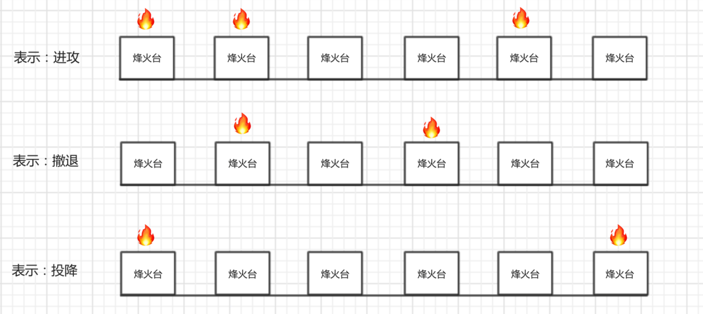

# day04 必备基础知识

## 今日概要

- 进制
- 单位
- 编码


## 1.进制

### 1.1 烽火狼烟

- 古代打仗用烽火狼烟来进行传递信号
- 生活中灯泡的亮与暗用来指示信息（用电来抓耗子，灯亮表示抓到了）




用亮灯用1表示，则上述的情景为：

- 110010

- 010100

- 100001


计算机本质上都有由晶体管和二极管组成（类比为灯泡），亮与灭都代表一定的信息，所以，本质计算机的所有操作：0101010。

为这些“10101010”来进行一定的格式化：

0

1

10

11

100

所以，二进制，满2进1.

### 小结

- 计算机的底层本质上都是二进制。
- 八进制、十进制、十六进制、二进制之间有对应关系。
- 满N进1位


## 2.单位

计算机中表示对于二进制大小的常见单位有：

- b（bit），位

  ```
    表示二进制有多少位，例如：      01101     就是 5位 = 5b      011011010 就是 9位 = 9b
  ```

- B（byte），字节

  ```
    8位就是1个字节，例如：  10100101                就是 8位 = 8b = 1B= 1个字节  1010010110100101        就是 16位 = 16b = 2B= 2个字节
  ```

- KB（Kilobyte），千字节

  ```
    1024个字节就是1千字节（1KB），即：  1 KB = 1024 B = 1024*8 b
  ```

- M（Megabyte），兆

  ```
    1024个千字节就是1兆（1M)，即：  1M = 1024 KB = 1024 * 1024 B = 1024 * 1024 * 8 b
  ```

- G（Gigabyte），千兆

  ```
    1024个兆就是1千兆（1G),即：  1G = 1024 M = 1024 * 1024 KB = 1024 * 1024 * 1024 B = 1024 * 1024 * 1024 * 8 b
  ```

- T（Terabyte），万亿字节

  ```
    1024个G就是1T
  ```

- …其他更大单位 PB/EB/ZB/YB/BB/NB/DB 不再赘述。

学完上面的这些单位之后，是不是就了解了平时大家说的自己有1G流量是啥意思了。


生活中的场景：

- 电脑的内存 4G
- 硬盘是1T
- 流量10G
- 流量有30M


## 3.编码

计算机底层本质都是二进制。


### 3.1 ascii编码

最多用二进制的8来表示所有的情况。

```
0000000
0000001
0000010
0000011
0000100
....
...
11111111

2**8=256
```


A  --> 按照ascii码对照表找到他对应的二进制  `01000001`


### 3.2 unicode（万国码）

- ucs2，用16位来表示所有的情况。2**16=65535

  ```
                               十六进制
  
  0000000 0000000 
  0000000 0000001
  0000000 0000010 
  0000000 1111111
  ...                           0025             %    
                                6B66             武
  ...
  11111111 11111111
  ```

- ucs4，用32位来表示所有的情况。2**32=4294967296

  ```
  0000000 0000000 0000000 0000000 
  ...
  0000000 0000000 0000000 11111111
  ...
  11111111 11111111 11111111 11111111
  ```

  

忠告：ucs2和ucs4应该根据自己的业务场景来进行选择。


### 3.3 utf-8编码

对unicode进行压缩，到底是如何压缩？

- 第一步：找模板

  ```
    码位范围（十六进制）                转换模板
     0000 ~ 007F              0XXXXXXX
     0080 ~ 07FF              110XXXXX 10XXXXXX
     0800 ~ FFFF              1110XXXX 10XXXXXX 10XXXXXX
    10000 ~ 10FFFF            11110XXX 10XXXXXX 10XXXXXX 10XXXXXX
    
    例如：
        "B"  对应的unicode码位为 0042，那么他应该选择的一个模板。
        "ǣ"  对应的unicode码位为 01E3，则应该选择第二个模板。
        "武" 对应的unicode码位为 6B66，则应该选择第三个模板。
        "沛" 对应的unicode码位为 6C9B，则应该选择第三个模板。
        "齐" 对应的unicode码位为 9F50，则应该选择第三个模板。
  ```

  注意：utf-8表示中文时，用的是3个字节。

- 第二步：码位以二进制展示，再根据模板进行转换

  ```
  码位拆分： "武"的码位为6B66，则二进制为 0110101101100110
  根据模板转换：
      6    B    6    6
      0110 1011 0110 0110
      ----------------------------
      1110XXXX 10XXXXXX 10XXXXXX    使用第三个模板
      11100110 10XXXXXX 10XXXXXX    第一步：取二进制前四位0110填充到模板的第一个字节的xxxx位置
      11100110 10101101 10XXXXXX    第二步：挨着向后取6位101101填充到模板的第二个字节的xxxxxx位置
      11100110 10101101 10100110    第二步：再挨着向后取6位100110填充到模板的第三个字节的xxxxxx位置
  最终，"武"对应的utf-8编码为 11100110 10101101 10100110
  ```

除了utf-8之外，其实还有一些其他的 utf-7/utf-16/utf-32 等编码，他们跟utf-8类似，但没有utf-8应用广泛。


## 编码答疑

```go
/*
 @Author:武沛齐  微信号：wupeiqi666
 @Description: 老男孩IT教育 & 路飞学城
 @Video:  https://space.bilibili.com/283478842
*/
package main

import (
	"fmt"
	"strconv"
)

func main() {
	// 定义字符串，字符串是以什么形式存在于Go编译器（utf-8编码）
	name := "武沛齐"

	// 其他语言：
	// 0 武
	fmt.Println(name[0], strconv.FormatInt(int64(name[0]), 2)) // 230  11100110
	fmt.Println(name[1], strconv.FormatInt(int64(name[1]), 2)) // 173  10101101
	fmt.Println(name[2], strconv.FormatInt(int64(name[2]), 2)) // 166  10100110

	// 1 沛
	fmt.Println(name[3])
	fmt.Println(name[4])
	fmt.Println(name[5])

	// 2 齐
	fmt.Println(name[6])
	fmt.Println(name[7])
	fmt.Println(name[8])
}

```


## 总结

本章的知识点属于理解为主，了解这些基础之后有利于后面知识点的学习，接下来对本节所有的知识点进行归纳总结：

1. 计算机上所有的东西最终都会转换成为二进制再去运行。
2. ascii编码、unicode字符集、utf-8编码本质上都是字符与二进制的关系。
   - ascii，字符和二进制的对照表。
   - unicode，字符和二进制（码位）的对照表。
   - utf-8，对unicode字符集的码位进行压缩处理，间接也维护了字符和二进制的对照表。
3. ucs2和ucs4指的是使用多少个字节来表示unicode字符集的码位。
4. 目前最广泛的编码为：utf-8，他可以表示所有的字符且存储或网络传输也不会浪费资源（对码位进行压缩了）。
5. 二进制、八进制、十进制、十六进制其实就是进位的时机不同。
6. 一个字节8位
7. b/B/KB/M/G的关系。
8. utf-8用3个字节表示中文。


参考文档：https://pythonav.com/wiki/detail/1/80/


